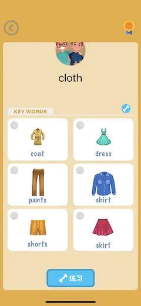
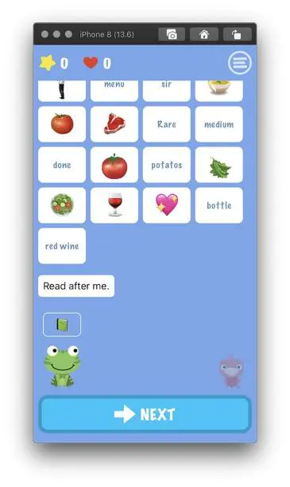
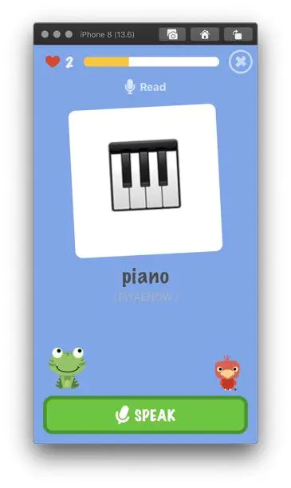
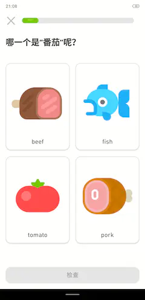
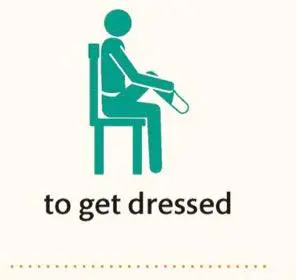

# 求flash card配图1000张

我们正在制作一个帮助英语口语练习的一个App，目前需要大概1000张的类似英语flash card的配图。

## 我们的使用场景

## 我们的要求
1. 如图二所示，在对话场景中，能够按照emoj的方式来使用图片，达到提醒用户语意的作用。所以我们的图片要求**在比较小的情况下，比如54*54pixel的情况下**，也可以清晰的表达含义。

2. 我们不要求所有图片一套风格，不过相关的词汇（比如春夏秋冬）要求风格统一

3. **风格上要求尽可能的简单**

4. 因为我们是初级口语App，所以单词并没有生僻词，基本上都在网上找到对应的flash card，**无需自己去设计如何通过图片表达含义**。

5. 如果你找图片有困难，我们可以帮助寻找

## 我们喜欢的风格
整体上要求简单抽象，具体可以参考下面图片

## 我们的预算
我们整体预算在5000左右

## 合作方式
请先画10张我们要求的单词，我们看一下风格；  
[单词请点击这里，我们已经配图，请按照图片内容把风格处理成我们需要的风格](https://iamalchemist.github.io/AI-Speak-Flashcard/wordset_1)

画之前有任何问题请联系我。  
如果风格ok，我们可以具体讨论交付方式，因为图片比较多，我们会考虑分批交付

## 联系方式
任何问题欢迎提问

> 微信号:iamwizard, QQ:282539259  
> 请备注：设计师

