# 单词第一批

###### Open
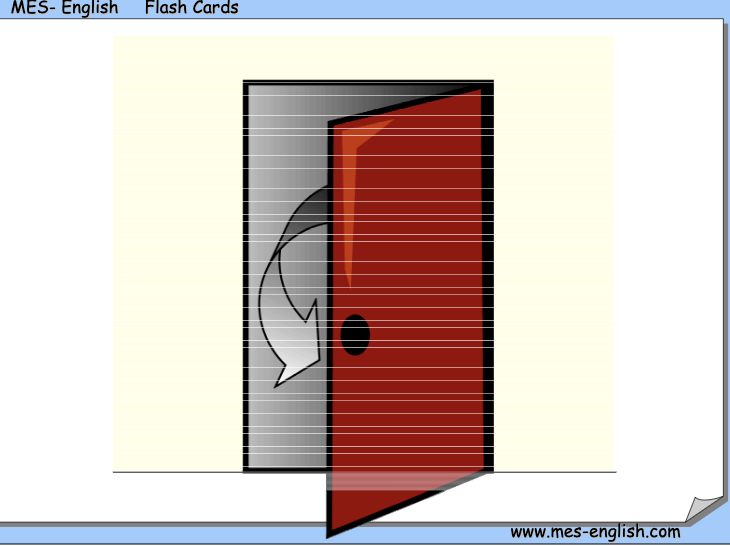

#### Bookstore
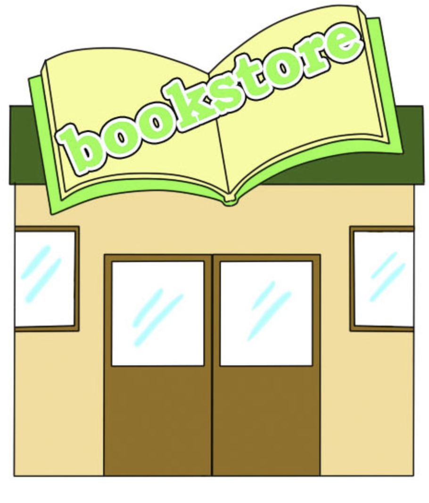

#### Age
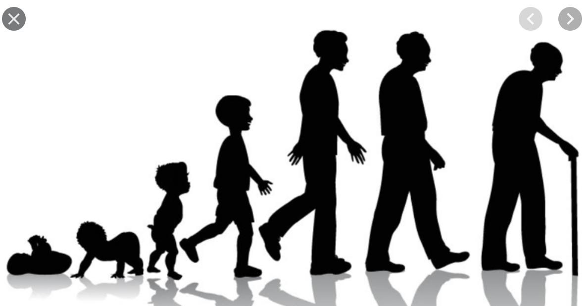

#### Breakfast
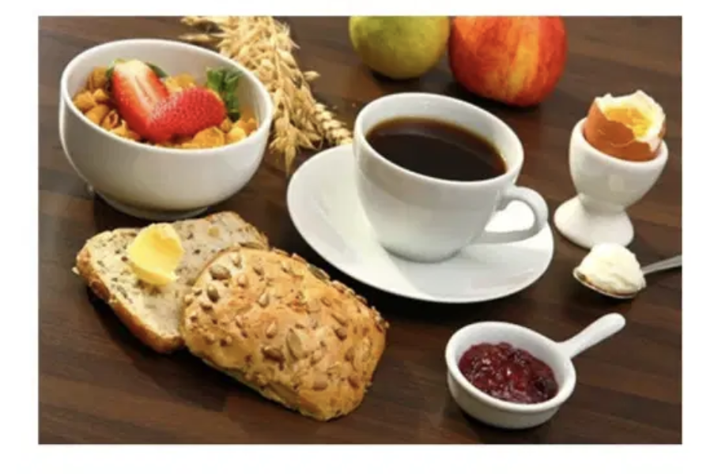
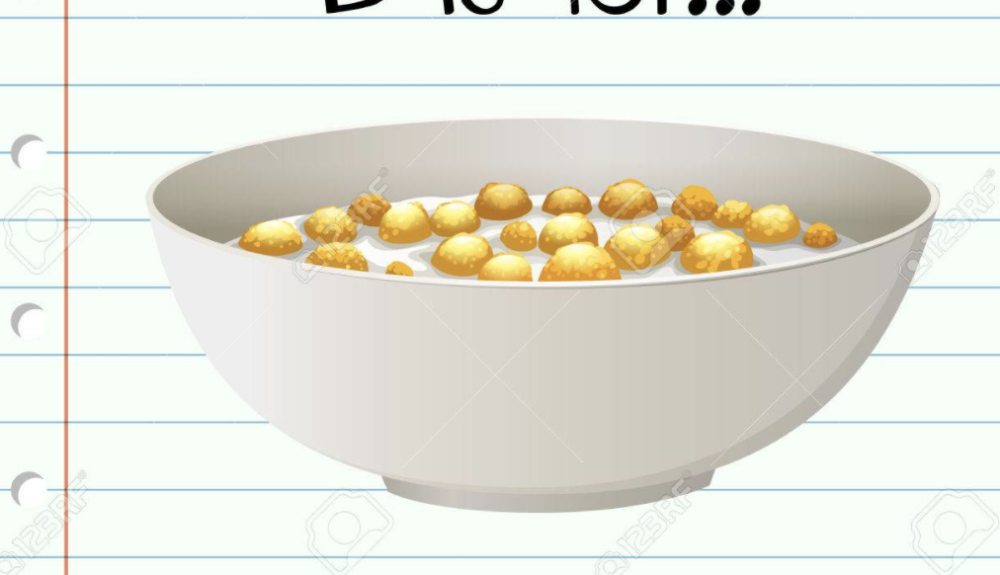
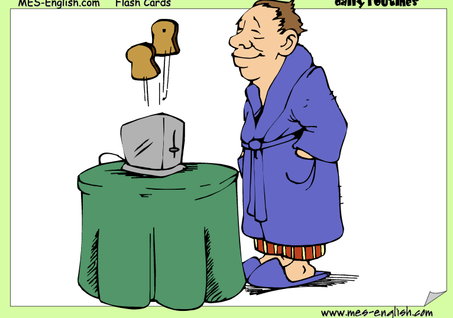

#### Homework
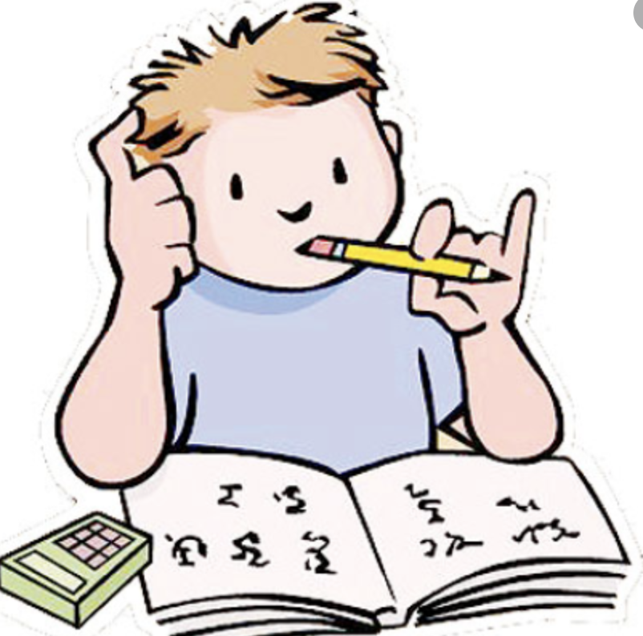

#### Egg
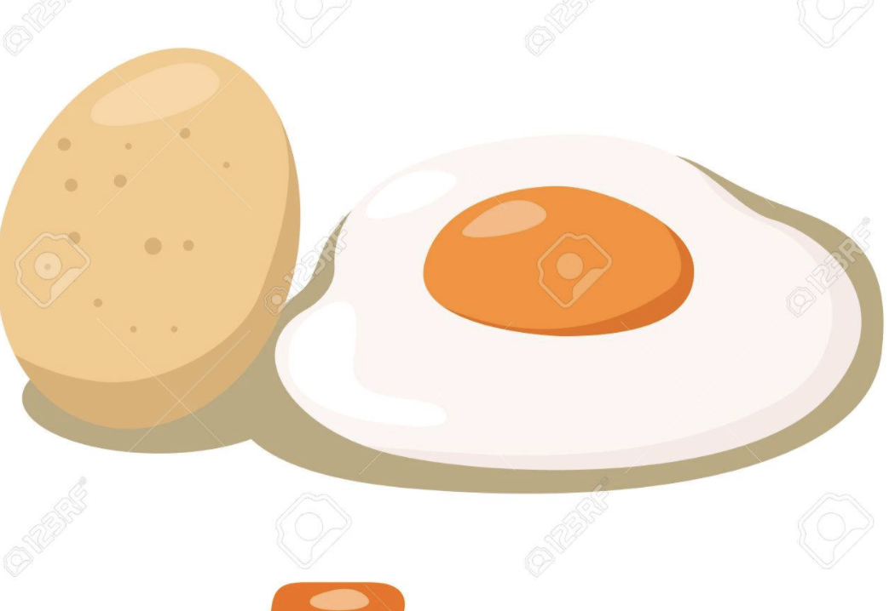

#### Smoke
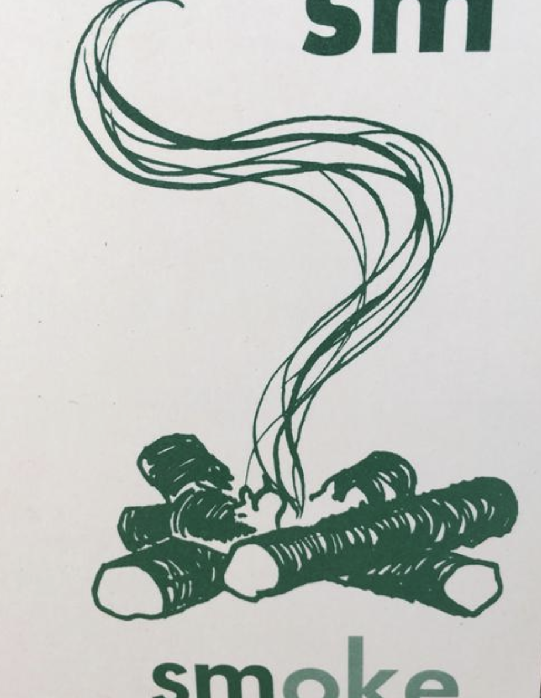

#### Spring/Summer/Autumn/Winter
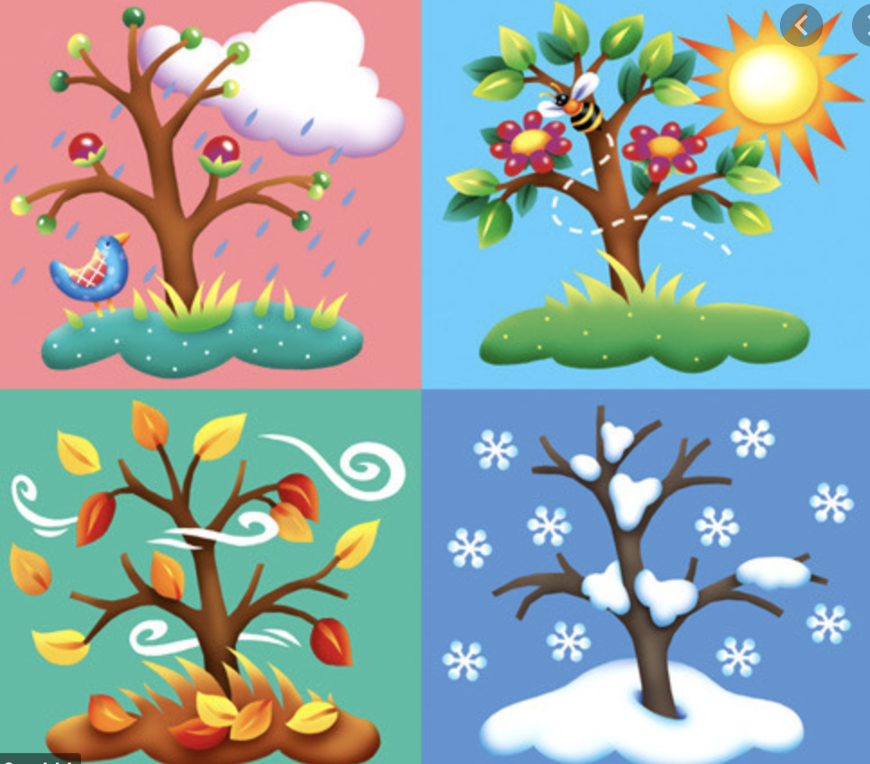

#### Afternoon/Morning/Evening/Night
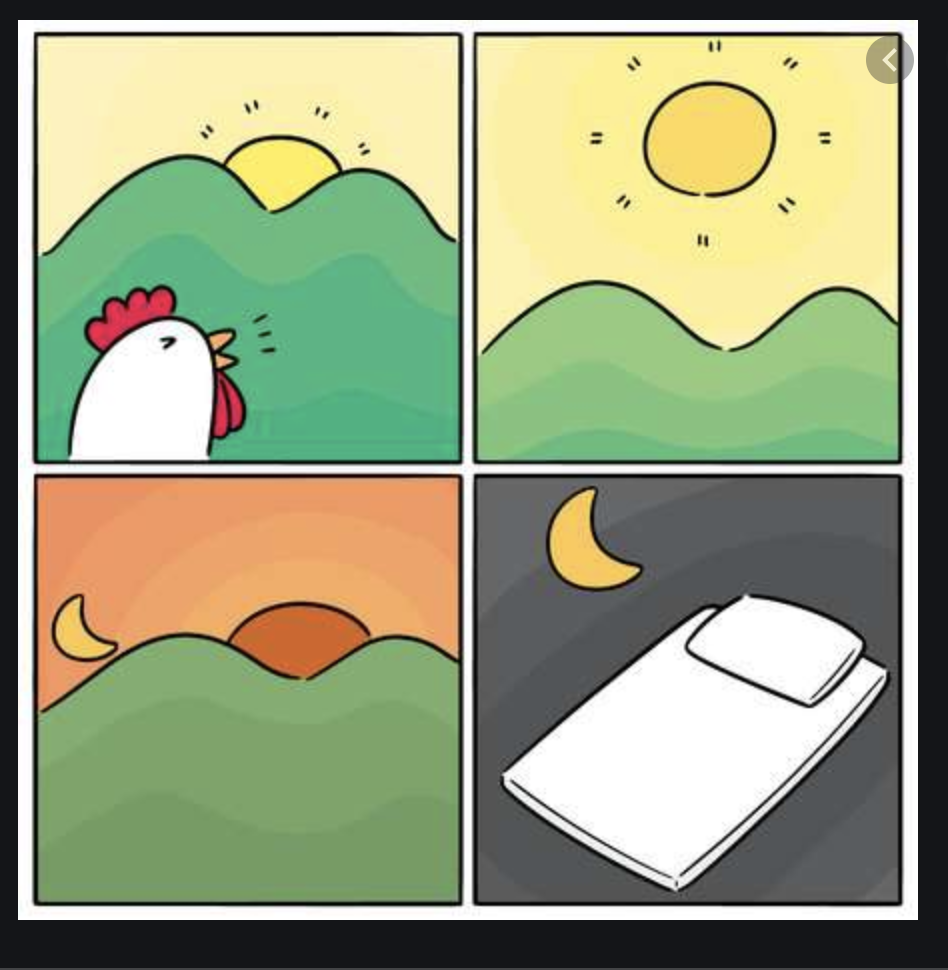

#### Today
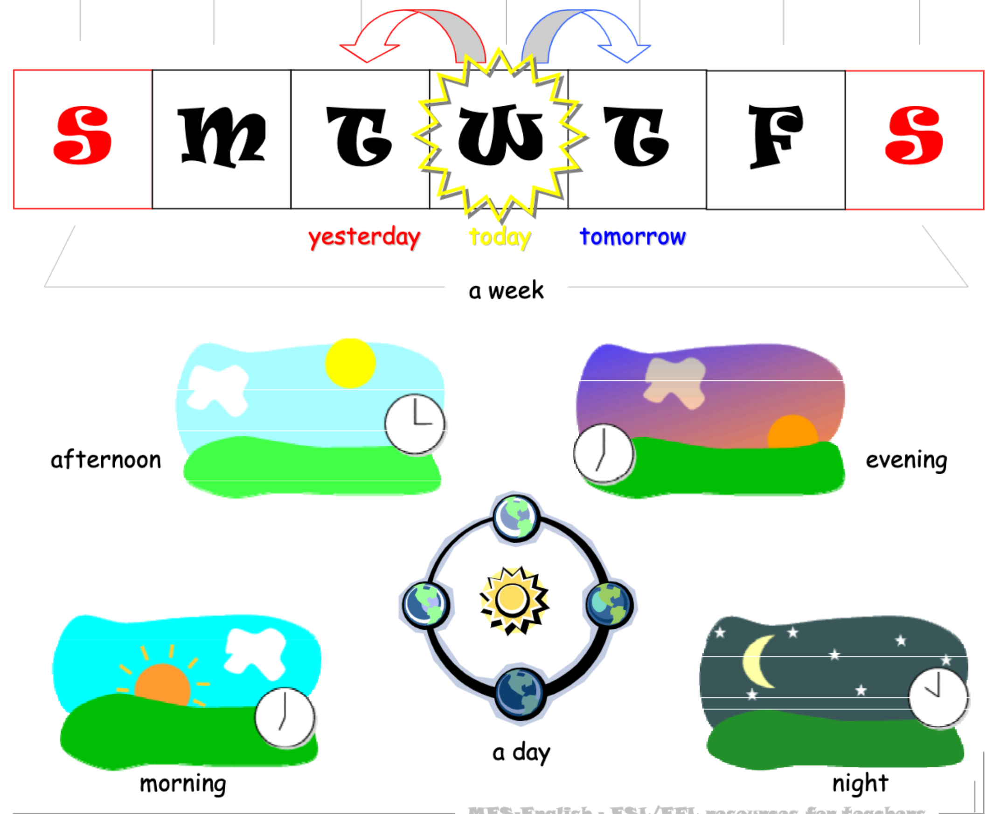
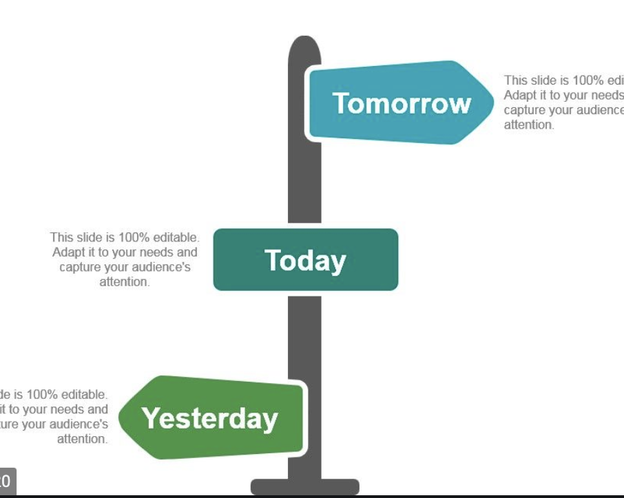

#### Go
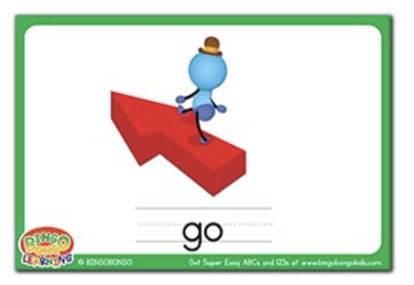

#### Stop

#### Catch
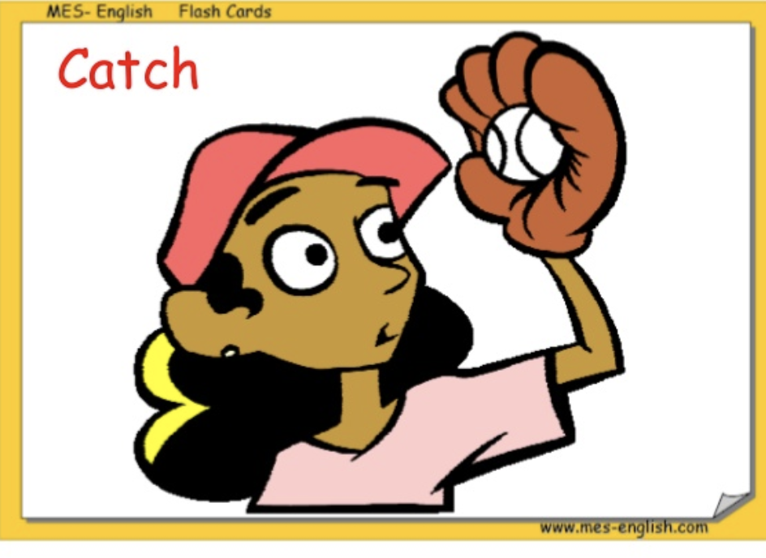

#### Wear
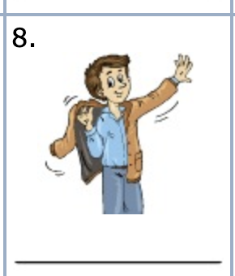